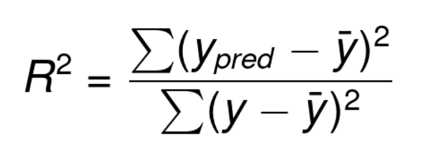

# ft_linear_regression

__Linear regression__ is one of the first algorithms that machine learning students learn, due to its fundamental nature.
It is an algorithm of [supervised learning](https://en.wikipedia.org/wiki/Supervised_learning), a paradigm in machine learning where input objects (for example, a vector of predictor variables) and a desired output value (also known as human-labeled supervisory signal) train a model.

__Linear regression__ is also a linear model, since it can only fit linear data points.

__Linear regression__ may be __simple__ and __multiple__, but on this occasion we will limit ourselves to analyze __simple linear regression__.

### Simple Linear Regression

__Simple linear regression__ is useful for finding the relationship between two continuous variables, an independent variable and a dependent or predictable one.

Given as input a set of data points, or vectors, containing a series of features, the goal is to obtain a line that best _fits_ the data. The best fit line is the one for which total prediction error is as small as possible. The error represents the vertical distance between each point and its predicted value on the __regression line__ or, in other words, the difference between actual and predicted values.

In the case of simple linear regression, the __regression line__ is represented as:
y = ax + b
where _x_ is the independent feature, _y_ is the dependent feature, _a_ is the slope and _b_ the y-intercept, or constant.

In this context, "fitting the data" means finding the parameters of a model (in this case, the regression line) that best represent the relationship between the input features (independent variables) and the output (dependent variable) in the data. Specifically, it involves determining the slope and intercept of the line that minimize the discrepancies between the observed values and the values predicted by the model.

The whole concept of __linear regression__ is based on the equation of a line:

The goal of the algorithm is to learn _theta0_, _theta1_, and _h(x)_.

### The Cost Function

The __cost function__ is a quadratic function (it usually traces a parabola) aiming at evaluating the performance of the model by computing a single scalar value that represents the total error across all data points. In __linear regression__, the most commonly used cost functions are the _Mean Squared Error (MSE)_:

and the _Sum of Squared Errors (SSE)_:

In the `train.py` program we use the _Mean Squared Error_ function, whose (optimized) formula may be written as follows:

or, to simplify:

where _m_ represents the total number of examples in the dataset.

A __cost function__ should ideally be __differentiable__ and __convex__ to facilitate efficient optimization, particularly when using gradient-based methods

A function is __differentiable__ if it has a derivative for each point in its domain as the following examples:

whereas functions which have a cusp or a discontinuity are non-differentiable:

On the other hand, a univariate function is convex if the line segment connecting two function’s points lays on or above its curve (it does not cross it). If it does it means that it has a local minimum which is not a global one.

### The Gradient

Intuitively, a __gradient__ is a slope of a curve at a given point in a specified direction.

In the case of a univariate function, it is simply the first derivative at a selected point. In the case of a multivariate function, it is a vector of derivatives in each main direction (along variable axes). Because we are interested only in a slope along one axis and we don’t care about others these derivatives are called partial derivatives.

### Gradient Descent

__Gradient Descent__ is an algorithm used in machine learning to minimize the error by iteratively adjusting the model parameters.

A machine learning model aims to minimize this error to achieve high accuracy.
Gradient Descent

#### Steps to Implement Gradient Descent:

    1. Randomly Initialize Values: Start with random parameter values;
    2. Update Values: Adjust the parameters using the gradient of the error with respect to each parameter;
    3. Repeat Until Convergence: Continue updating until the slope (derivative) is zero, indicating a minimum error.

#### Key Concepts:

* __Derivative__: Represents the slope of the error function at a particular point, guiding the direction to adjust parameters.
* __Learning Rate (Alpha)__: Determines the size of the steps taken during each update.

    * If too small, the model learns slowly.
    * If too large, the model may overshoot the minimum and fail to converge.

This process ensures that the model parameters are adjusted in the direction that reduces the error, leading to an optimal solution.

### R-squared value:

To measure the goodness of our regression line, we will use __R-squared value__, or __coefficient of determination__.

> R-squared value is a statistical measure of how close the data are to the fitted regression line.

To calculate __R-squared value__ we will use the following formula:

Where _y_ is the actual value, _yₚᵣₑ𝒹_ is the predicted _y_ value and _y̅_ is the mean.

Basically, we calculate the difference between the predicted value and the mean, then divide it by the difference between the actual value and the mean.

The higher the __R-squared value__ the better our model performance will be. So as the __R-squared value__ gradually increases, the distance of actual points from the __regression line__ decreases, and the performance of the model increases.

### Conclusions

To conclude, the goal is to find the parameters _a_ and _b_ of a linear function _f(x)=ax+b_. To achieve this, you consider a function _T(a,b)_ which represents a type of average error between the estimated value f(x) and the real values, more specifically a variance. You aims at minimizing this error.

The method used to find the minimum of _T(a,b)_ is called the gradient descent algorithm. If you delve into the details and calculate the gradient of _T(a,b)_, you will derive the formulas provided in the project subject: if you take _T(a,b)=(1/N)∑(pi−a⋅ki+b)^2_ where _N_ is the number of price/kilometer pairs _(pi,ki)_ obtained from a .csv file, and _a_ and _b_ are the parameters of T.

Conceptually, _T_ is just a surface function, and you seek the coordinates of the point where the surface's altitude is the lowest. You start with an initial point (in the subject, it's _(a0=0, b0=0)_), calculate the gradient at this point, and then follow the direction opposite to the gradient (to minimize the function).

From there, you have an initial point _(a0,b0)_ and a direction (−x0,−y0). You move from the starting point in the opposite direction of the gradient to find a new point: _(a0,b0)+coef⋅(−x0,−y0)=(a1,b1)_.

This completes the first iteration of the algorithm. The point _(a1,b1)_ provides a lower altitude than _(a0,b0)_, meaning _T(a1,b1)<T(a0,b0)_. You then repeat the same process, replacing _(a0,b0)_ with _(a1,b1)_, and continue until the difference between _T(an,bn)_ and _T(an+1,bn+1)_ is sufficiently small.

The coefficient in the formula is the __convergence coefficient__ (__learning rate__). There is an optimal way to find this value, but that is a different topic. With a sufficiently small value, the algorithm will work, although it may not be the fastest.

The _learning rate_, denoted as _coef_, helps guide the updates to _a_ and _b_ to minimize the error. Specifically, in each iteration, you compute temporary values _atemp_​ and _btemp_​, then update _a_ and _b_ as follows:

_a1=learning_rate⋅atemp+a0_
_b1=learning_rate⋅btemp+b0_

You repeat this process until the algorithm converges to the minimum error.

The function _T(a,b)_ compares the estimated price for a given mileage with the actual price. It is defined as:
_f(x)=a⋅x+b_
This is the function you aim to find through the algorithm. To compare, you calculate:
_actual_price−f(actual_mileage)_

Since you have multiple data points, you take the average of the differences:
_1/Number_of_data∑(actual_price−f(actual_mileage))_

To avoid negative values in this measure, you square each term, resulting in:
_1/Number_of_data∑(actual_price−f(actual_mileage))^2_

Expanding _f_ in this formula gives:
_1/Number_of_data∑(actual_price−(a⋅actual_mileage+b))^2_

This final formula is _T(a,b)_, representing the average error between the function _a⋅x+b_ and the real data. Minimizing _T(a,b)_ helps find _a_ and _b_ such that the line _a⋅x+b_ best fits the data points.

The gradient descent algorithm is a mathematical technique to find a local minimum of a function, ensuring the function meets certain properties.

### Bibliography

I approached machine learning from a [YouTube video playlist](https://www.youtube.com/watch?v=EUD07IiviJg&list=PLO_fdPEVlfKqUF5BPKjGSh7aV9aBshrpY) by Machine Lernia (in French).

The foundations of my `train.py` program are inspired by Sindhu Seelam's article ["Linear Regression From Scratch in Python WITHOUT Scikit-learn"](https://medium.com/geekculture/linear-regression-from-scratch-in-python-without-scikit-learn-a06efe5dedb6) published on Medium.

Other articles I used for the explanations and the redaction of the present README file are:
- Daksh Trehan's articles ["Linear Regression Explained"](https://pub.towardsai.net/linear-regression-explained-f5cc85ae2c5c) and ["Gradient Descent Explained"](https://towardsdatascience.com/gradient-descent-explained-9b953fc0d2c);
- Robert Kwiatkowski's article ["Gradient Descent Algorithm — a deep dive"](https://medium.com/towards-data-science/gradient-descent-algorithm-a-deep-dive-cf04e8115f21);
- Jatin Mehra's article [Understanding Gradient Descent: A Beginner’s Guide](https://medium.com/@jatinmehra119/understanding-gradient-descent-a-beginners-guide-ad1f948b4b0a).

I used [Desmos Graphing Calculator](https://www.desmos.com/calculator) to graphically display the functions for my examples.

To normalize the values of my arrays of mileage and prices I followed the tip of Cina on [StackOverflow](https://stackoverflow.com/a/41532180).

To add argument flags to the program, I used the [argparse](https://docs.python.org/3/library/argparse.html) library, and in particular I followed [Managing arguments in Python with argparse](https://stackoverflow.com/a/11618620)
[Managing boolean arguments](https://stackoverflow.com/questions/15008758/parsing-boolean-values-with-argparse)
